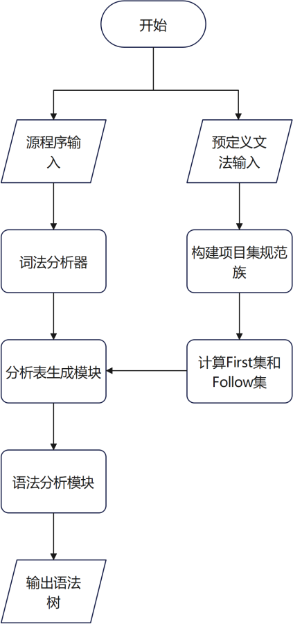
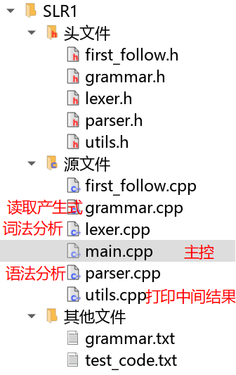

# SLR(1) 语法分析器

> HITWH-AI 编译原理实验语法分析器源代码
使用dev-C++开发（其实是小熊猫C++），ISO-C++17标准进行编译（在选项里记得勾选上）
> 一个基于编译原理课程实现的 SLR(1) 语法分析器，用于对给定文法构建分析表并对输入串进行语法分析。支持错误检测、分析过程输出，并具备良好的模块化设计，便于后续扩展。

## 📌 项目简介

本项目实现了一个简单的 SLR(1) 语法分析器，具备以下功能：

- 输入上下文无关文法（支持多产生式）
- 自动构造 LR(0) 项目集规范族
- 计算 FOLLOW 集
- 构建 SLR(1) 分析表（ACTION 和 GOTO）
- 对输入串进行语法分析，输出分析过程
- 检测语法错误并提示错误信息

本项目旨在帮助学习者深入理解 SLR(1) 语法分析的原理与实现过程。

---

## ✨ 功能特点

- ✅ 支持任意用户自定义文法（无左递归、符合 SLR(1) 条件）
- ✅ 自动构建分析表并检测冲突
- ✅ 支持分析过程详细输出（状态栈、符号栈、输入串、动作）
- ✅ 错误处理机制完善，输出错误位置与提示
- ✅ 模块化结构清晰，便于拓展语法树、中间代码等功能

---

## 📂 项目结构
### 逻辑结构


### 物理结构说明


---

## 🚀 快速开始

###  克隆项目

```bash
git clone https://github.com/your-username/slr-parser.git
cd slr-parser
```

##  🧪 示例

### 输入文法（`grammar.txt`）

```
E → E + T | T
T → T * F | F
F → ( E ) | id
```

### 输入串（`test_code.txt`）

```
id + id * id
```

### 分析过程输出（部分）

```
步骤   状态栈      符号栈      剩余输入          动作
------------------------------------------------------------
1      [0]         []           id+id*id$        移进 id
2      [0,5]       [id]         +id*id$          归约 F → id
3      [0,3]       [F]          +id*id$          归约 T → F
...
9      [0,1]       [E]          $                接受
```

---

## ⚙️ 开发环境

- 语言： C++ 17
- 操作系统：Windows / Linux / macOS
- 编辑器推荐：VS Code / CLion / Dev-C++ / 小熊猫C++（'**强烈推荐：巨好用！**'）

---

## 📌 实现要点

- 使用 LR(0) 项目集构造规范族；
- FOLLOW 集采用迭代法计算；
- 分析表以哈希表（字典）形式实现，键为 (状态, 符号)；
- 分析器使用状态栈与符号栈进行移进/归约操作；
- 支持错误检测与提示。

---

## 📈 后续扩展建议

- ✅ 支持语法树构建与可视化（如输出为 DOT 图）
- ✅ 支持中间代码生成（如三地址码）
- ✅ 支持错误恢复策略（如 panic 模式）
- ✅ 支持 GUI 可视化分析过程
- ✅ 支持 LALR(1) 或 LR(1) 分析器的扩展

---

## 🤝 贡献方式

欢迎提交 PR 或 Issue 来改进本项目：

1. Fork 本仓库
2. 创建你的分支 (`git checkout -b feature/xxx`)
3. 提交更改 (`git commit -am 'Add xxx'`)
4. 推送到分支 (`git push origin feature/xxx`)
5. 创建 Pull Request

---

## 📄 License

本项目基于 [MIT License](LICENSE) 开源，欢迎自由使用与修改。

---

## 📬 联系方式

如有问题或建议，欢迎通过以下方式联系我：

- Email: triblesix@foxmail.com
- GitHub: [@nikolasludriane](https://github.com/nikolasludrian)

---

感谢阅读，欢迎 Star ⭐️ 支持本项目！
